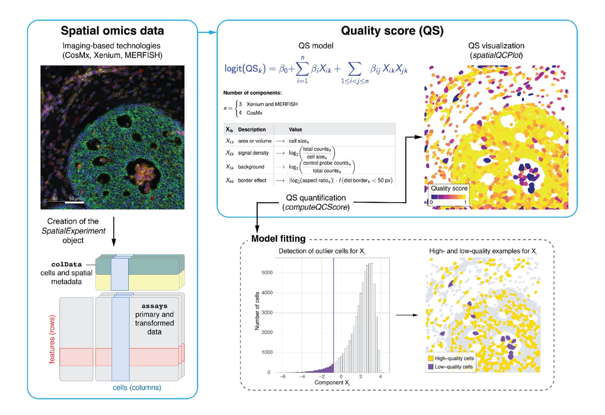

# SpaceTrooper
[](https://www.r-project.org/)
[](https://opensource.org/license/mit)

`SpaceTrooper` is an `R/Bioconductor` package for Quality Control
of imaging-based spatial transcriptomics and proteomics data. It provides 
multi-platform data harmonization, cell-level QC, and visualization utilities 
for **CosMx**, **Xenium**, and **MERFISH** technologies.

<p align="left">
	
</p>


`SpaceTrooper` main highlights:
- Read and harmonize imaging-based spatial data into SpatialExperiment objects.
- Compute polygon-derived metrics (area, aspect ratio, borders).
- Calculate QC metrics, detect spatial outliers and calculate Quality Score.
- Visualize computed metrics on centroids or polygons.
- Support CosMx RNA/Protein Assay, Xenium, and MERFISH data.

<p align="left">
	
</p>


<br/><br/>


## System requirements and installation

### Requirements
`SpaceTrooper` depends on **R version >= 4.4.0**, **Bioconductor >= 3.22** and **SpatialExperiment (1.20.0)**.
The package has been tested on Windows, macOS, and Linux.

### Bioconductor (Release 3.22)
The stable version of the package is in `Bioconductor 3.22`, and it can be installed with the following code.
If you already have Bioconductor 3.22, it usually takes less than a minute.

```r
if (!requireNamespace("BiocManager", quietly = TRUE)) {
	install.packages("BiocManager")
}
BiocManager::install("SpaceTrooper")
```

We suggest to use the a version of `SpaceTrooper` higher or equal to 1.1.3, which can be downloaded as 
explained in the "devel" section.

### Bioconductor (devel)
The devel version of `SpaceTrooper` can be downloaded as follows. 
Please remember that it is stable only if using an R version >= 4.4.0.

```r
if (!requireNamespace("BiocManager", quietly = TRUE)) {
	install.packages("BiocManager")
}

BiocManager::install("SpaceTrooper", ref="devel")
```

### Anaconda (for conda/mamba environments)

`SpaceTrooper` package can be installed in a Conda-compatible environment on Linux (x86_64), using the provided installation file [SpaceTrooper.yml](inst/SpaceTrooper.yml). 
Before proceeding with the provided installation, you have to install a Conda-compatible distribution, such as [Anaconda](https://www.anaconda.com/download).

To create the environment run the following code:

```bash
conda env create -f SpaceTrooper.yml
conda activate SpaceTrooper
```

Otherwise, if you installed Mamba/Micromamba distribution you have to run 'mamba' instead of 'conda'

```bash
mamba env create -f SpaceTrooper.yml
mamba activate SpaceTrooper
```

Once the environment is activated, open `R` and install the latest developmental `SpaceTrooper` version as described above.

```r
if (!requireNamespace("BiocManager", quietly = TRUE)) {
	install.packages("BiocManager")
}
BiocManager::install("SpaceTrooper", ref="devel") 
```
<br/><br/>


## Quick start

The typical `SpaceTrooper` workflow require the following steps:

1. read a dataset into a SpatialExperiment object
2. load existing polygon data (optionally)
3. calculate per cell-QC metrics
4. compute QS
5. visualize polygons, centroids, and QC summaries.

Minimal example pipeline:

```r
library(SpaceTrooper)

# 1. Read a dataset (choose the reader that matches your platform).
spe <- readCosmxSPE("path/to/cosmx")
# spe <- readXeniumSPE("path/to/xenium")
# spe <- readMerfishSPE("path/to/merfish")

# 2. Add polygons from existing polygon data.
spe <- readAndAddPolygonsToSPE(spe, boundariesType="csv")

# 3. Calculate and add QC metrics to cell metadata.
spe <- spatialPerCellQC(spe)

# 4. Compute QS and, optionally, flag cells with a score higher than 'qsThreshold'.
spe <- computeQCScore(spe)
spe <- computeQCScoreFlags(spe, qsThreshold=0.5)

# 5. Visualization
## Visualize cells as dots in their centroid coordinates, colored by a column in `colData(spe)` (e.g., QS computed above).
plotCentroids(spe, colourBy='QC_score')

## Visualize cells using their polygon shapes, colored by a column in `colData(spe)` (e.g., QS computed above).
## To visualize polygons step 2 is mandatory.
## Polygons can be cumbersome to plot for large datasets (e.g., entire slides with more than 100,000 cells), hence centroids may be preferred. 
plotPolygons(spe, colourBy='QC_score')
```
<br/><br/>


## Data support
`SpaceTrooper` provides readers and QC utilities tailored to:

- **CosMx** RNA and protein data
- **Xenium**
- **MERFISH**

<br/><br/>


## Vignettes
The package includes three vignettes that cover:

- [Imaging-based spatial transcriptomics workflows](https://bioconductor.org/packages/devel/bioc/vignettes/SpaceTrooper/inst/doc/RNA_tutorial_vignette.html)
- [CosMx protein workflow](https://bioconductor.org/packages/devel/bioc/vignettes/SpaceTrooper/inst/doc/Protein_tutorial_vignette.html)
- [SpaceTrooper interoperability](https://bioconductor.org/packages/devel/bioc/vignettes/SpaceTrooper/inst/doc/interoperability.html)


Refer to the first vignette if working with CosMx, Xenium or MERFISH spatial trancriptomics platforms; refer to the second vignette if working with CosMx Protein Assay data. Third vignette illustrates how SPE objects obtained with SpatialExperimentIO can be imported into our pipeline, along with some other package utility functions and plots. 

Function-level help is available through standard R documentation, for example:

```r
?computeQCScore
?plotPolygons
```

<br/><br/>


## Issues
Please report bugs or feature requests at:
[https://github.com/drighelli/SpaceTrooper/issues](https://github.com/drighelli/SpaceTrooper/issues).

## License
`SpaceTrooper` is released under a [MIT license](LICENSE) file.

## Citations

Benedetta Banzi, Dario Righelli, Matteo Marchionni, Oriana Romano, Mattia Forcato, Davide Risso, Silvio Bicciato. *SpaceTrooper: a quality control framework for imaging-based spatial omics data*. bioRxiv 2025.12.24.696336; doi: [https://doi.org/10.64898/2025.12.24.696336](https://doi.org/10.64898/2025.12.24.696336)
